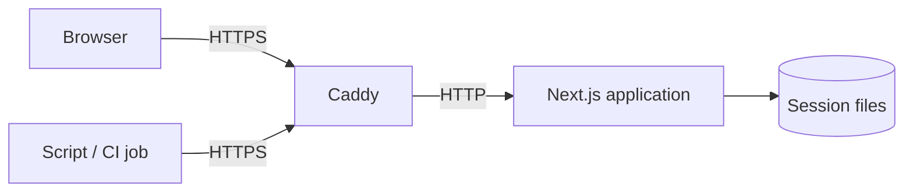

# Project Overview

Rasadgah ("observatory" in Persian) is a web application that renders key performance indicators (KPIs) uploaded as a JSON file.

## Table of Contents

- [1. Purpose](#1-purpose)
- [2. Scope](#2-scope)
- [3. Out of Scope](#3-out-of-scope)
- [4. System Overview](#4-system-overview)
- [5. Key Features](#5-key-features)
- [6. Architecture](#6-architecture)
- [7. Requirements](#7-requirements)
- [8. Current Status](#8-current-status)
- [9. Known Limitations](#9-known-limitations)
- [10. Related Documents](#10-related-documents)

## 1. Purpose

Teams need to share a small set of KPIs without operating a dashboard platform or managing user accounts. Rasadgah gives each visitor an access token, accepts a KPI file for that token and renders it as a dashboard at a stable URL.

## 2. Scope

- Issuing anonymous access tokens.
- Uploading and validating KPI files through the browser or an HTTP API.
- Rendering KPIs with value, change, trend and target status.
- Expiring tokens one week after the last upload and deleting their data.
- HTTPS delivery and deployment as a Docker Compose stack.

## 3. Out of Scope

- User accounts, login, password recovery or token recovery.
- Historical KPI series and charts. Each upload replaces the previous report.
- Sharing one dashboard between tokens or granting read-only access.
- Horizontal scaling across multiple application instances (see [ADR-002](../03-design/adr/adr-002-file-based-session-storage.md)).

## 4. System Overview

A visitor who opens `/` without a token receives a new token. Uploading a KPI file with that token stores the report. Opening `/?token=<token>` renders the stored report.

## 5. Key Features

- Token issued on first visit, with copy-to-clipboard and a dashboard link.
- KPI upload from the browser or with `curl` (`PUT /api/kpis`).
- Validation with field-level error messages.
- KPI cards with formatted value, change versus previous value, trend and target status.
- Sliding seven-day token lifetime.
- Automatic HTTPS through Caddy, including Let's Encrypt certificates.
- Single-command deployment with Docker Compose and a GitHub Actions pipeline.

## 6. Architecture

See [DES-001 System Architecture](../03-design/architecture.md).

## 7. Requirements

See [REQ-000 System Requirements](../01-requirements/requirements.md).

## 8. Current Status

Version 0.1.0. All requirements in REQ-000 are implemented and covered by the tests in [TST-000](../05-testing/test-specification.md). Production deployment has not been performed yet.

## 9. Known Limitations

- A lost token cannot be recovered. The data becomes unreachable and is deleted when the token expires.
- Anyone who has a token can read and replace that token's report.
- The rate limiter keeps state in memory and resets when the application restarts.
- Only one application instance is supported because sessions are stored on a local volume.

## 10. Related Documents

- [Documentation index](../README.md)
- [User Guide](../06-user/user-guide.md)
- [How to deploy to a server](../howtos/howto-deploy-to-server.md)
