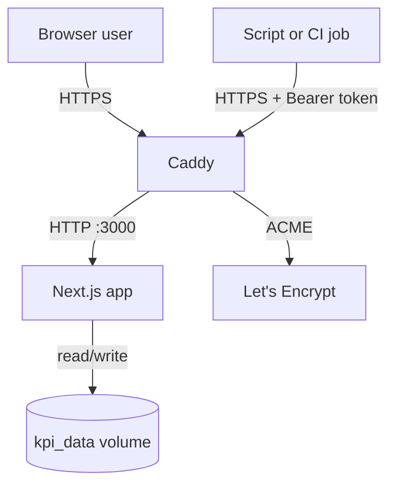
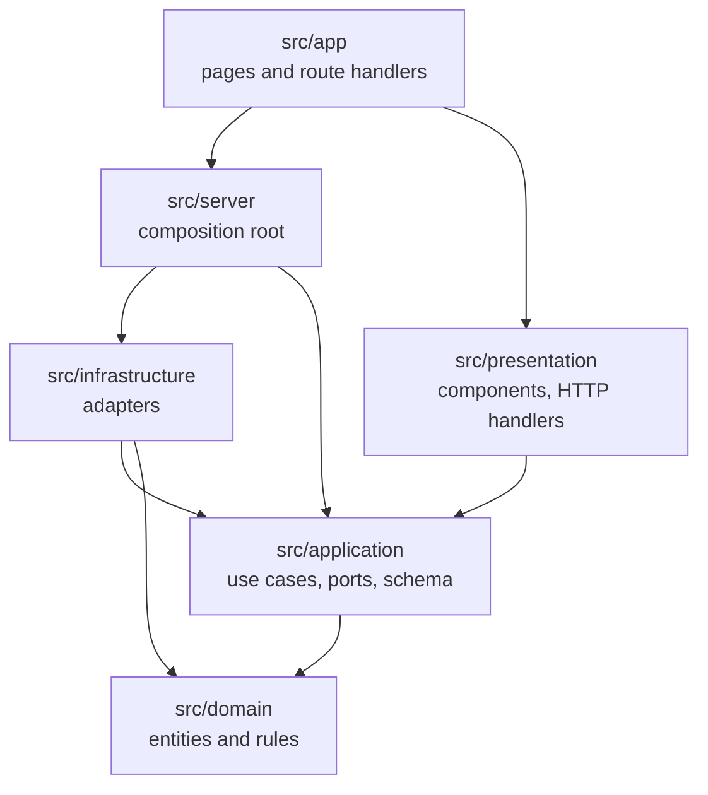
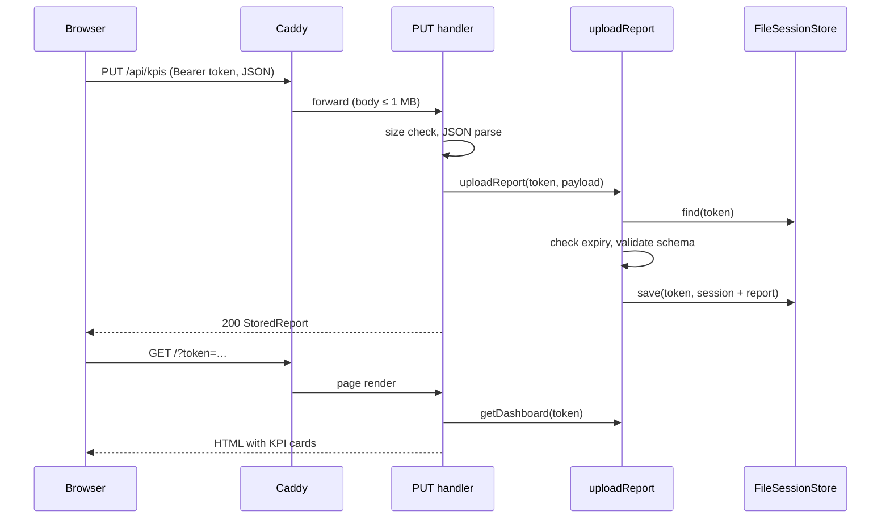
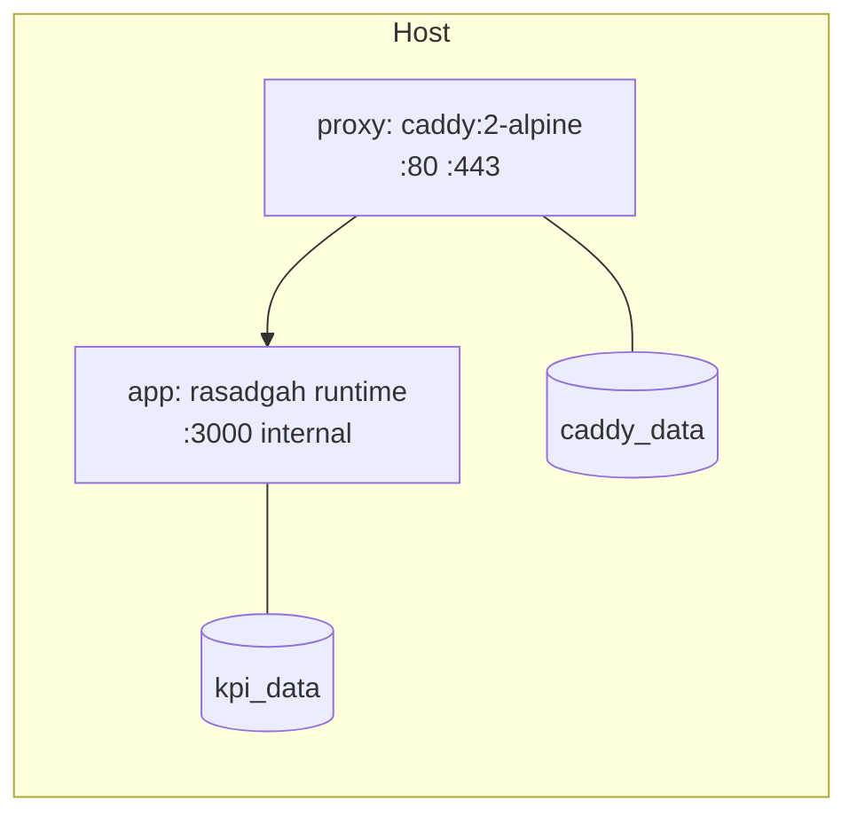

# System Architecture

## Table of Contents

- [1. Purpose](#1-purpose)
- [2. Architecture Goals](#2-architecture-goals)
- [3. System Context](#3-system-context)
- [4. High-Level Architecture](#4-high-level-architecture)
- [5. Components](#5-components)
  - [5.1 Domain](#51-domain)
  - [5.2 Application](#52-application)
  - [5.3 Infrastructure](#53-infrastructure)
  - [5.4 Presentation](#54-presentation)
  - [5.5 Composition root](#55-composition-root)
  - [5.6 Next.js adapters](#56-nextjs-adapters)
- [6. Data Flow](#6-data-flow)
- [7. Security](#7-security)
- [8. Deployment](#8-deployment)
- [9. Scalability and Performance](#9-scalability-and-performance)
- [10. Failure Handling](#10-failure-handling)
- [11. Constraints](#11-constraints)
- [12. Alternatives Considered](#12-alternatives-considered)
- [13. Related Requirements](#13-related-requirements)
- [14. Related Documents](#14-related-documents)

## 1. Purpose

Describes how Rasadgah is structured and deployed, and why. Requirements are defined in [REQ-000](../01-requirements/requirements.md).

## 2. Architecture Goals

- Business rules shall be testable without Next.js, React, the file system or the clock.
- Framework and storage choices shall be replaceable by changing one adapter and the composition root.
- The production stack shall consist of two containers and no external services.

## 3. System Context

## 4. High-Level Architecture

The source follows Clean Architecture. Arrows show allowed import directions.

The rules are enforced by `no-restricted-imports` in [eslint.config.mjs](../../eslint.config.mjs) and listed in [REF-010](../../.ai/project/rules/10-typescript-coding-standards.md).

## 5. Components

### 5.1 Domain

Purpose: pure business rules.

Responsibilities:

- `kpi.ts` — KPI entity; change ratio, trend, assessment, target status.
- `session.ts` — session entity; token format, lifetime, expiry.
- `format.ts` — value, change and date formatting.

Dependencies: none.

### 5.2 Application

Purpose: use cases and the contracts they need.

Responsibilities:

- `useCases.ts` — `issueToken`, `uploadReport`, `getReport`, `getDashboard` and the dashboard view model.
- `ports.ts` — `SessionStore`, `TokenGenerator`, `Clock` interfaces.
- `kpiReportSchema.ts` — validation of [INT-001](../02-specification/kpi-file-format.md).
- `errors.ts` — `AppError` and `isAppError`.

Dependencies: domain, zod.

### 5.3 Infrastructure

Purpose: implementations of the ports.

Responsibilities:

- `fileSessionStore.ts` — one JSON file per session (see [ADR-002](adr/adr-002-file-based-session-storage.md)).
- `memorySessionStore.ts` — in-memory store for tests.
- `system.ts` — cryptographic token generator and system clock.
- `rateLimiter.ts` — fixed-window, in-memory rate limiter.

Dependencies: application ports, domain, Node.js `crypto` and `fs`.

### 5.4 Presentation

Purpose: translate between HTTP/React and use cases.

Responsibilities:

- `http/handlers.ts` — framework-independent `Request → Response` handlers for the API (API-001).
- `components/` — `DashboardView`, `KpiCard`, `TokenPanel`, `UploadForm` (client), `Notice`.

Dependencies: application. Receives use cases as arguments; never imports the composition root.

### 5.5 Composition root

`src/server/container.ts` builds adapters from environment variables and wires them into the use cases. The instance is cached on `globalThis` so that all Next.js bundles share one store and one rate limiter.

### 5.6 Next.js adapters

- `src/app/page.tsx` — server-rendered page: issues a token or renders the dashboard.
- `src/app/api/*/route.ts` — export handlers created by the presentation factories.
- `src/instrumentation.ts` — starts the hourly purge of expired sessions when the server starts.

## 6. Data Flow

Upload from the browser and rendering of the dashboard:

## 7. Security

- TLS termination, HTTP→HTTPS redirect and HSTS by Caddy ([ADR-003](adr/adr-003-caddy-tls-termination.md)).
- Response headers set in [next.config.ts](../../next.config.ts): `Content-Security-Policy`, `Referrer-Policy: no-referrer`, `X-Content-Type-Options: nosniff`, `X-Frame-Options: DENY`, `Permissions-Policy`. `X-Powered-By` is disabled.
- Tokens: 192-bit random, stored only as SHA-256 file names, redacted from proxy logs ([DES-002](session-lifecycle.md)).
- Input: size limits in proxy and application, schema validation, React output escaping.
- Container: runtime image runs as user `node`; the app port is not published.

Rules: [REF-011 Project Security Rules](../../.ai/project/rules/40-security.md).

## 8. Deployment

The [Dockerfile](../../Dockerfile) defines the stages `deps`, `source`, `dev`, `test`, `build`, `e2e` and `runtime`. The runtime stage contains only the Next.js standalone output. [compose.yaml](../../compose.yaml) defines `app` and `proxy` (default) and `dev`, `test`, `e2e` (profiles). Procedure: [PROC-002](../howtos/howto-deploy-to-server.md).

## 9. Scalability and Performance

- One application instance. Session state is on a local volume, and the rate limiter is in memory.
- Pages are rendered per request (`force-dynamic`); static assets under `/_next/static` are cached for one year.
- Purge cost grows linearly with the number of session files; it runs once per hour.

## 10. Failure Handling

- Unexpected errors in API handlers are logged and returned as `500` with a generic message.
- Session files are written to a temporary file and renamed, so a crash cannot leave a partially written session.
- Corrupt session files are skipped by the purge.
- Docker restarts both containers (`restart: unless-stopped`); the proxy starts only after the app health check passes.

## 11. Constraints

- Single instance (see Section 9).
- Next.js `output: 'standalone'` requires `public/` and `.next/static` to be copied next to `server.js`; the `postbuild` script does this.

## 12. Alternatives Considered

- Static export without a server — rejected because tokens and uploads require server state ([ADR-001](adr/adr-001-nextjs-standalone-server.md)).
- Database storage — deferred ([ADR-002](adr/adr-002-file-based-session-storage.md)).
- User accounts — rejected ([ADR-004](adr/adr-004-anonymous-bearer-tokens.md)).

## 13. Related Requirements

REQ-001 to REQ-008, NFR-001 to NFR-006.

## 14. Related Documents

- [DES-002 Token and Session Lifecycle](session-lifecycle.md)
- [API-001 HTTP API Specification](../02-specification/api-specification.md)
- [REF-004 Developer Reference](../07-reference/developer-reference.md)
