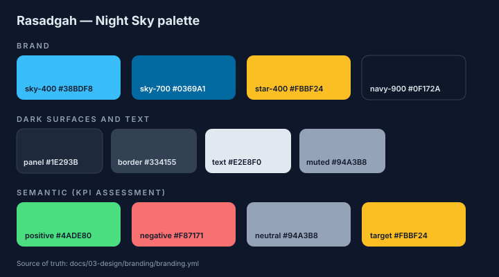

# Colour Palette

## Table of Contents

- [1. Palette Concept](#1-palette-concept)
- [2. Brand Colours](#2-brand-colours)
- [3. Dark Theme (Default)](#3-dark-theme-default)
- [4. Light Surfaces](#4-light-surfaces)
- [5. Semantic Colours](#5-semantic-colours)
- [6. CSS Implementation](#6-css-implementation)
- [7. Accessibility](#7-accessibility)
- [8. Related Documents](#8-related-documents)

## 1. Palette Concept

**Night Sky.** The interface is the night sky seen from an observatory: a deep navy canvas, sky-blue instruments and an amber star that marks the target. Green and red are used only to assess KPI changes.

Authoritative values: [branding.yml](../branding.yml). Machine-readable mirror: [palette.json](palette.json). Visual reference: [swatches.svg](swatches.svg).



## 2. Brand Colours

| Token      | Hex       | Usage                                                                 |
| ---------- | --------- | --------------------------------------------------------------------- |
| `sky-400`  | `#38BDF8` | Accent on dark surfaces: buttons, links, logo mark                    |
| `sky-700`  | `#0369A1` | Accent on light surfaces: light logo tagline, links in light contexts |
| `star-400` | `#FBBF24` | Target marker: the logo star; reserved for "target" meaning           |
| `navy-900` | `#0F172A` | Canvas, icon tile, text on accent                                     |

## 3. Dark Theme (Default)

| Token       | Hex       | CSS variable | Usage                                  |
| ----------- | --------- | ------------ | -------------------------------------- |
| `bg`        | `#0F172A` | `--bg`       | Page background                        |
| `panel`     | `#1E293B` | `--panel`    | Panels, KPI cards                      |
| `border`    | `#334155` | `--border`   | Panel and card borders, header divider |
| `text`      | `#E2E8F0` | `--text`     | Body text, values                      |
| `muted`     | `#94A3B8` | `--muted`    | Labels, metadata, neutral card border  |
| `accent`    | `#38BDF8` | `--accent`   | Buttons, links                         |
| `on-accent` | `#0F172A` | `--bg`       | Text on accent buttons                 |

## 4. Light Surfaces

The application has no light theme. These values apply to the light logo variant, printed material and documentation pages with a light background.

| Token    | Hex       |
| -------- | --------- |
| `bg`     | `#F8FAFC` |
| `panel`  | `#FFFFFF` |
| `border` | `#E2E8F0` |
| `text`   | `#0F172A` |
| `muted`  | `#475569` |
| `accent` | `#0369A1` |

## 5. Semantic Colours

KPI cards use the assessment defined in [INT-001, Section 4](../../../02-specification/kpi-file-format.md#4-presentation-rules).

| Meaning                                         | Hex       | CSS variable | Applied to                                                        |
| ----------------------------------------------- | --------- | ------------ | ----------------------------------------------------------------- |
| Positive (change in the desired direction)      | `#4ADE80` | `--positive` | Card left border, change text                                     |
| Negative (change against the desired direction) | `#F87171` | `--negative` | Card left border, change text, "Off target", notices, form errors |
| Neutral (no change or no previous value)        | `#94A3B8` | `--muted`    | Card left border                                                  |
| Target                                          | `#FBBF24` | —            | Logo star. Reserved for a future target indicator.                |

Colour shall never be the only signal: the change text carries ▲ / ▼ / ■ and a screen-reader description, and target status is written out ("On target" / "Off target").

## 6. CSS Implementation

The tokens are defined in [src/app/globals.css](../../../../src/app/globals.css):

```css
:root {
  --bg: #0f172a;
  --panel: #1e293b;
  --border: #334155;
  --text: #e2e8f0;
  --muted: #94a3b8;
  --accent: #38bdf8;
  --positive: #4ade80;
  --negative: #f87171;
  --radius: 12px;
  color-scheme: dark;
}
```

Components shall use these variables and must not declare literal colours.

## 7. Accessibility

Contrast ratios (WCAG 2.1, relative luminance):

| Foreground          | Background         | Ratio    | WCAG level for normal text |
| ------------------- | ------------------ | -------- | -------------------------- |
| text `#E2E8F0`      | bg `#0F172A`       | 13.6 : 1 | AAA                        |
| text `#E2E8F0`      | panel `#1E293B`    | 11.2 : 1 | AAA                        |
| muted `#94A3B8`     | bg `#0F172A`       | 7.0 : 1  | AAA                        |
| muted `#94A3B8`     | panel `#1E293B`    | 5.7 : 1  | AA                         |
| accent `#38BDF8`    | bg `#0F172A`       | 8.3 : 1  | AAA                        |
| on-accent `#0F172A` | accent `#38BDF8`   | 8.3 : 1  | AAA                        |
| positive `#4ADE80`  | panel `#1E293B`    | 8.4 : 1  | AAA                        |
| negative `#F87171`  | panel `#1E293B`    | 5.3 : 1  | AA                         |
| star `#FBBF24`      | bg `#0F172A`       | 10.7 : 1 | AAA                        |
| text `#0F172A`      | light bg `#F8FAFC` | 17.1 : 1 | AAA                        |
| accent `#0369A1`    | light bg `#F8FAFC` | 5.7 : 1  | AA                         |

New colour pairs shall reach at least 4.5 : 1 for text and 3 : 1 for non-text indicators.

## 8. Related Documents

- [DES-010 Theming and Localisation](../theme.md)
- [REF-022 Logo Assets and Usage](../logo/README.md)
