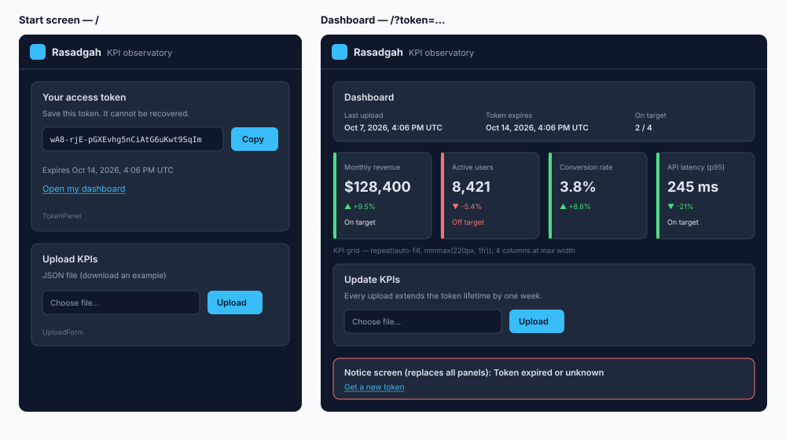

# GUI Layout

## Table of Contents

- [1. Overview](#1-overview)
- [2. Page Frame](#2-page-frame)
- [3. Screens](#3-screens)
  - [3.1 Start screen (no token)](#31-start-screen-no-token)
  - [3.2 Editor (write token)](#32-editor-write-token)
  - [3.3 Shared view (read token)](#33-shared-view-read-token)
  - [3.4 Notice (invalid token or rate limit)](#34-notice-invalid-token-or-rate-limit)
- [4. Components](#4-components)
  - [4.1 KPI card](#41-kpi-card)
  - [4.2 Upload form](#42-upload-form)
  - [4.3 Token panel](#43-token-panel)
  - [4.4 Copy field](#44-copy-field)
  - [4.5 Freshness line](#45-freshness-line)
  - [4.6 JSON editor](#46-json-editor)
  - [4.7 Empty-state hero](#47-empty-state-hero)
- [5. Responsive Behaviour](#5-responsive-behaviour)
- [6. Accessibility](#6-accessibility)
- [7. Related Documents](#7-related-documents)

## 1. Overview

Rasadgah has one page (`/`) with four screens, selected on the server by the `token` query parameter and its access level. Implementation: [src/app/page.tsx](../../../../src/app/page.tsx) and [src/presentation/components/](../../../../src/presentation/components/).



## 2. Page Frame

| Region | Content                                                                                | Style                                                                        |
| ------ | -------------------------------------------------------------------------------------- | ---------------------------------------------------------------------------- |
| Header | Logo mark (32 px), "Rasadgah" (link to `/`, not prefetched), tagline "KPI observatory" | Full width, 1 px bottom border `--border`, padding 1 rem × 1.5 rem           |
| Main   | Screen content                                                                         | Centred, max. width 1100 px, padding 1.5 rem, vertical grid with 1.5 rem gap |

## 3. Screens

### 3.1 Start screen (no token)

| Order | Region       | Content                                                                    |
| ----- | ------------ | -------------------------------------------------------------------------- |
| 1     | Token panel  | See Section 4.3                                                            |
| 2     | Upload panel | Heading "Upload KPIs", link to the example file, upload form (Section 4.2) |

A successful upload navigates to the editor.

### 3.2 Editor (write token)

| Order | Region       | Content                                                                                                                                                                                    |
| ----- | ------------ | ------------------------------------------------------------------------------------------------------------------------------------------------------------------------------------------ |
| 1     | Status panel | Heading "Editor"; definition list: "Last upload" (UTC time and age), "Tokens expire", "On target" (`met / with target`, only when a KPI has a target); copy field "Share link (read-only)" |
| 2     | KPI grid     | One KPI card per KPI (Section 4.1); or the empty state "No KPIs uploaded yet…" in a panel                                                                                                  |
| 3     | Update panel | Heading "Update KPIs", note that every upload extends both tokens by one week, upload form                                                                                                 |
| 4     | Edit panel   | Heading "Edit JSON", one-sentence hint, JSON editor (Section 4.6)                                                                                                                          |

### 3.3 Shared view (read token)

Deliberately minimal (REQ-009): no panels, controls or token information.

| Order | Region         | Content              |
| ----- | -------------- | -------------------- |
| 1     | Freshness line | Section 4.5          |
| 2     | KPI grid       | One KPI card per KPI |

While there are no KPIs to show, both regions are replaced by the empty-state hero (Section 4.7).

### 3.4 Notice (invalid token or rate limit)

A single panel with a `--negative` border, `role="alert"`, a heading ("Token expired or unknown" or "Too many requests"), one explanatory sentence and the link "Get a new token" to `/`.

## 4. Components

### 4.1 KPI card

```text
┌▌────────────────────────────────┐
│▌ Monthly revenue                │  label    0.9 rem, --muted
│▌ $128,400                       │  value    1.9 rem, bold
│▌ ▲ +9.5%                        │  change   0.85 rem, assessment colour
│▌ On target · target $125,000    │  target   0.85 rem, red when missed
└▌────────────────────────────────┘
 ▲ 4 px left border: --positive / --negative / --muted
```

- Element: `<article aria-labelledby>` with `data-assessment`.
- The target line is omitted when the KPI has no target.

### 4.2 Upload form

| State     | Presentation                                                                     |
| --------- | -------------------------------------------------------------------------------- |
| Idle      | File input (accepts `.json`), button "Upload"                                    |
| Uploading | Button disabled, label "Uploading…"                                              |
| Success   | `role="status"` text "Upload successful.", then navigation                       |
| Error     | `role="alert"` block in `--negative` with the message and a list of field errors |

### 4.3 Token panel

Heading "Your tokens", warning that the tokens cannot be recovered, then two copy fields (Section 4.4): "Write token" with the hint "Keep it secret. It uploads KPIs and opens the editor." and "Read token" with the hint "Share it. It shows your KPIs read-only." Below: the common expiry time and the links "Open editor" and "Open shared view".

### 4.4 Copy field

Small muted label, value in a bordered monospace `<code>` block, "Copy" button (label changes to "Copied"; accessible name "Copy <label>"). For links, the button copies the absolute URL and an "Open" link follows.

### 4.5 Freshness line

```text
Updated 3 hours ago (Oct 7, 2026, 9:00 AM UTC) · data as of Oct 7, 2026, 8:00 AM UTC
        └ <time datetime="…">, --text, 600 ┘  └ 0.85 rem, --muted ┘   └ only when generatedAt is set ┘
```

The age is computed on the server at request time.

### 4.6 JSON editor

| Element  | Presentation                                                                                                                       |
| -------- | ---------------------------------------------------------------------------------------------------------------------------------- |
| Label    | "KPI JSON", 0.85 rem, `--muted`                                                                                                    |
| Text box | `<textarea>`, full width, min. height 20 rem, monospace 0.9 rem, `--bg` background, 2-space tabs, spell check off, vertical resize |
| Content  | Stored report pretty-printed with 2 spaces; before the first upload, a one-KPI template                                            |
| Save     | Primary button; label "Saving…" while the request runs; on success `role="status"` "Saved." and the page refreshes                 |
| Format   | Secondary (outlined) button; re-indents valid JSON                                                                                 |
| Reset    | Secondary button; restores the stored content; disabled while unchanged                                                            |
| Errors   | Same alert block as the upload form; invalid JSON shows "Invalid JSON: …" without a request                                        |

### 4.7 Empty-state hero

```text
                 ┌────────────────────────────────────┐
                 │   [logo-dark.svg, up to 900 px]    │
                 │                                    │
                 │       Observe what matters.        │  clamp(2rem, 6vw, 4.5rem), 700
                 │                                    │
                 │       No KPIs published yet.       │  --muted
                 └────────────────────────────────────┘
       min-height: 100vh − 10 rem, content centred on both axes, 2 rem gap
```

- Element: `<section aria-labelledby="hero-slogan">`; the logo image has the alternative text "Rasadgah — KPI observatory".
- After an upload without KPIs, the note reads "The latest upload contains no KPIs." followed by the freshness line.
- Asset: [public/brand/logo-dark.svg](../../../../public/brand/logo-dark.svg), a copy of [logo-dark.svg](../logo/logo-dark.svg).

## 5. Responsive Behaviour

- KPI grid: `repeat(auto-fill, minmax(220px, 1fr))` with 1 rem gap. At the maximum content width (1052 px) this gives 4 columns; below 456 px content width, 1 column.
- Token block, upload form and status list wrap with `flex-wrap`.
- Long tokens break with `word-break: break-all`.

## 6. Accessibility

- Landmarks: `<header>`, `<main>`, `<section aria-labelledby>` for every panel.
- Trend arrows are `aria-hidden`; a visually hidden text states "change, trend up/down/flat".
- Assessment is never conveyed by colour alone (see [DES-011, Section 5](../color-palette/color-palette.md#5-semantic-colours)).
- Form messages use `role="status"` and `role="alert"` so that screen readers announce them.
- The file input has a visible `<label>`.
- The JSON text box has a visible `<label>`; Format and Reset are keyboard-reachable buttons.

## 7. Related Documents

- [REQ-000 System Requirements](../../../01-requirements/requirements.md), REQ-001, REQ-004, REQ-006, REQ-009
- [DES-010 Theming and Localisation](../theme.md)
