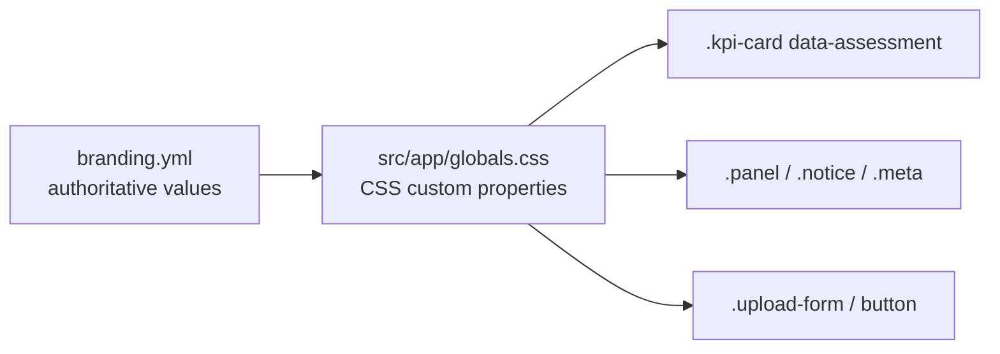

# Theming and Localisation

## Table of Contents

- [1. Purpose](#1-purpose)
- [2. Theme Architecture](#2-theme-architecture)
- [3. Rules](#3-rules)
- [4. Change the Accent Colour](#4-change-the-accent-colour)
- [5. Add a Light Theme](#5-add-a-light-theme)
- [6. Replace the Logo (White-Labelling)](#6-replace-the-logo-white-labelling)
- [7. Localisation](#7-localisation)
  - [7.1 Current behaviour](#71-current-behaviour)
  - [7.2 Add a locale](#72-add-a-locale)
- [8. Related Documents](#8-related-documents)

## 1. Purpose

Describes how the visual theme is implemented, how to change it, and how text and number formatting can be localised.

## 2. Theme Architecture



There is one theme, **night-sky** (dark). All colours are CSS custom properties on `:root` in [src/app/globals.css](../../../src/app/globals.css); see [DES-011, Section 6](color-palette/color-palette.md#6-css-implementation). KPI cards select their colour with the `data-assessment` attribute (`positive`, `negative`, `neutral`) and target lines with `data-status` (`met`, `missed`).

## 3. Rules

- Components shall reference CSS variables and must not contain literal colours.
- Assessment and status colours shall be applied through `data-*` attributes, not through class names chosen in TypeScript.
- A new colour shall be added to [branding.yml](branding.yml), [palette.json](color-palette/palette.json), [DES-011](color-palette/color-palette.md) and `globals.css` in the same change.
- Every new text/background pair shall be checked against [DES-011, Section 7](color-palette/color-palette.md#7-accessibility).

## 4. Change the Accent Colour

1. Choose a colour with at least 4.5 : 1 contrast against `#0F172A` and against `--bg` as button text.
2. Set `--accent` in `globals.css`.
3. Update `colors.dark.accent` in `branding.yml`, `palette.json` and DES-011.
4. Keep the logo in `sky-400`; the logo colour is part of the identity and does not follow the accent.

## 5. Add a Light Theme

Not implemented. To add one:

1. Add a block using the values from [DES-011, Section 4](color-palette/color-palette.md#4-light-surfaces):

   ```css
   @media (prefers-color-scheme: light) {
     :root {
       --bg: #f8fafc;
       --panel: #ffffff;
       --border: #e2e8f0;
       --text: #0f172a;
       --muted: #475569;
       --accent: #0369a1;
       color-scheme: light;
     }
   }
   ```

2. Change button text from `var(--bg)` to a dedicated `--on-accent` variable (`#ffffff` in light mode).
3. Verify `--positive` and `--negative` on `#ffffff`. The dark-theme values do not reach 4.5 : 1 on white; use `#15803D` and `#B91C1C`.
4. Use `logo-light.svg` in light mode.
5. Add `light` to `themes.available` in `branding.yml`.

## 6. Replace the Logo (White-Labelling)

1. Replace [public/brand/logo-icon.svg](../../../public/brand/logo-icon.svg) with a square SVG (64 × 64 viewBox recommended). It is used as favicon and header mark.
2. Change the site name in [src/app/layout.tsx](../../../src/app/layout.tsx) (`metadata.title` and the header).
3. Adjust `--accent` as in Section 4.

## 7. Localisation

### 7.1 Current behaviour

- UI text is English and written directly in the components.
- Numbers and dates are formatted with the fixed locale `en-US` and dates in UTC, in [src/domain/format.ts](../../../src/domain/format.ts). The server renders the page, so the visitor's browser locale is not used.
- KPI labels are displayed as uploaded and can be in any language. `<html lang="en">` is set in the layout.

### 7.2 Add a locale

1. Change `formatValue`, `formatChange` and `formatDateTime` to accept a locale parameter, and pass it from the use case in `src/application/useCases.ts`.
2. Choose the locale on the server, for example from a `LOCALE` environment variable added to [REF-001](../../07-reference/configuration.md), or from the `Accept-Language` header.
3. Move UI strings from the components into a message catalogue per locale.
4. For right-to-left languages (for example Persian), set `dir="rtl"` on `<html>` and replace physical CSS properties (`border-left`) with logical ones (`border-inline-start`).
5. Extend `src/domain/format.test.ts` with cases for the new locale.

## 8. Related Documents

- [DES-011 Colour Palette](color-palette/color-palette.md)
- [DES-012 GUI Layout](gui-layout/layout-description.md)
