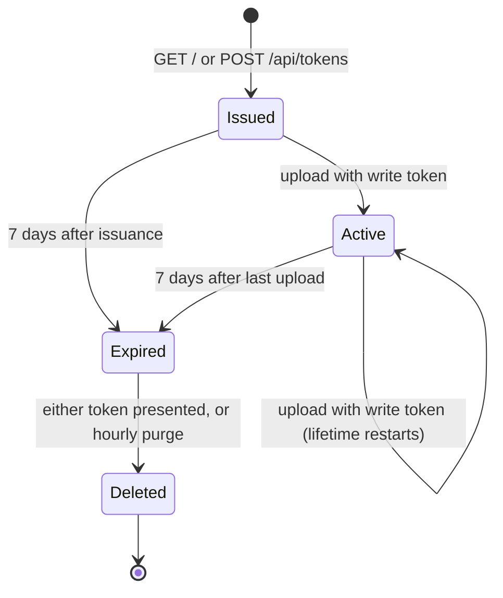

# Token and Session Lifecycle

## Table of Contents

- [1. Purpose](#1-purpose)
- [2. Responsibilities](#2-responsibilities)
- [3. Interfaces](#3-interfaces)
- [4. Data Structures](#4-data-structures)
- [5. State Machine](#5-state-machine)
- [6. Algorithms](#6-algorithms)
  - [6.1 Token generation](#61-token-generation)
  - [6.2 Read-token derivation](#62-read-token-derivation)
  - [6.3 Session resolution](#63-session-resolution)
  - [6.4 Expiry](#64-expiry)
  - [6.5 Purge](#65-purge)
- [7. Error Handling](#7-error-handling)
- [8. Concurrency](#8-concurrency)
- [9. Configuration](#9-configuration)
- [10. Requirements Implemented](#10-requirements-implemented)
- [11. Tests](#11-tests)
- [12. Related Documents](#12-related-documents)

## 1. Purpose

Defines how write and read tokens are created, resolved to an access level, expired and deleted, and how session data is stored. Decision record: [ADR-005](adr/adr-005-read-and-write-tokens.md).

## 2. Responsibilities

- Generate unguessable write tokens and derive read tokens from them.
- Persist one session per dashboard without storing either token.
- Resolve a presented token to `write` or `read` access.
- Enforce the sliding seven-day lifetime shared by both tokens.
- Delete expired sessions.

## 3. Interfaces

`SessionStore` port ([src/application/ports.ts](../../src/application/ports.ts)). The `key` is always the read token.

| Method               | Behaviour                                           |
| -------------------- | --------------------------------------------------- |
| `find(key)`          | Returns the session or `null`.                      |
| `save(key, session)` | Creates or replaces the session atomically.         |
| `delete(key)`        | Removes the session; no error if absent.            |
| `purgeExpired(now)`  | Removes all expired sessions and returns the count. |

`TokenGenerator` port:

| Method                     | Behaviour                             |
| -------------------------- | ------------------------------------- |
| `generate()`               | Returns a new random write token.     |
| `readTokenFor(writeToken)` | Returns the read token (Section 6.2). |

## 4. Data Structures

```ts
interface Session {
  createdAt: string;            // ISO 8601
  lastUploadAt: string | null;  // ISO 8601, null before the first upload
  report: KpiReport | null;     // INT-001
}
```

On disk (`DATA_DIR`, default `/data` in the container):

```text
/data/<sha256(read token) as 64 hex chars>.json   mode 0600
```

The write token is never stored in any form.

## 5. State Machine



Viewing with either token, a failed upload (invalid JSON, schema violation, oversize body) and an upload attempt with the read token do not change the state.

## 6. Algorithms

### 6.1 Token generation

24 bytes from `crypto.randomBytes`, encoded as base64url → 32 characters from `[A-Za-z0-9_-]`, 192 bits of entropy.

### 6.2 Read-token derivation

```text
readToken = base64url( SHA-256( "read:" + writeToken )[0..24) )
```

The result has the same format as a write token. SHA-256 is one-way, so the write token cannot be computed from the read token. Implemented in [src/infrastructure/system.ts](../../src/infrastructure/system.ts).

### 6.3 Session resolution

`resolveSession` in [src/application/useCases.ts](../../src/application/useCases.ts):

1. Reject unless the token matches `^[A-Za-z0-9_-]{32}$`. This check also prevents path traversal.
2. Treat the token as a write token: look up `readTokenFor(token)`. If found, access is `write`.
3. Otherwise treat it as a read token: look up `token`. If found, access is `read`.
4. If the session found is expired, delete it and reject. If none is found, reject.

All rejections raise `AppError('TOKEN_INVALID')` with one shared message (REQ-006). An upload with `read` access raises `AppError('TOKEN_READ_ONLY')` before the payload is validated (REQ-010).

### 6.4 Expiry

```text
expiresAt = (lastUploadAt ?? createdAt) + 604 800 000 ms
expired   = now ≥ expiresAt
```

Implemented in [src/domain/session.ts](../../src/domain/session.ts).

### 6.5 Purge

`src/instrumentation.ts` runs `purgeExpired` once at server start and then every hour. The file store reads each `*.json` file, deletes expired sessions and skips unreadable files.

## 7. Error Handling

- `ENOENT` while reading a session is treated as "not found"; other file-system errors propagate and produce HTTP 500.
- A purge failure is logged and retried at the next interval.

## 8. Concurrency

- Writes go to `<file>.<uuid>.tmp` and are renamed over the target, which is atomic on POSIX file systems.
- Two concurrent uploads for the same dashboard are resolved by "last rename wins".
- Running more than one application instance against the same volume is not supported.

## 9. Configuration

| Variable   | Effect                       |
| ---------- | ---------------------------- |
| `DATA_DIR` | Directory for session files. |

Lifetime and token length are constants in the domain layer and are not configurable. See [REF-001](../07-reference/configuration.md).

## 10. Requirements Implemented

REQ-001, REQ-005, REQ-006, REQ-008, REQ-010, NFR-002.

## 11. Tests

TST-001, TST-005, TST-006, TST-008, TST-010, TST-016 in [TST-000](../05-testing/test-specification.md).

## 12. Related Documents

- [DES-001 System Architecture](architecture.md)
- [ADR-002 File-based session storage](adr/adr-002-file-based-session-storage.md)
- [ADR-005 Separate read and write tokens](adr/adr-005-read-and-write-tokens.md)
- [PROC-004 How to back up and restore data](../howtos/howto-backup-restore.md)
