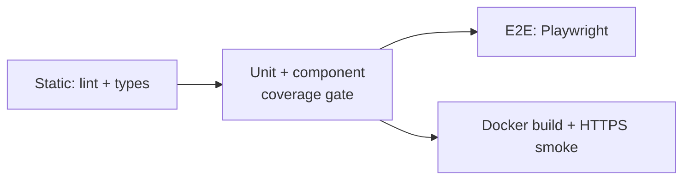

# Test Specification

## Table of Contents

- [1. Purpose](#1-purpose)
- [2. Scope](#2-scope)
- [3. Test Environment](#3-test-environment)
- [4. Test Levels](#4-test-levels)
- [5. Test Cases](#5-test-cases)
- [6. Test Data](#6-test-data)
- [7. Pass/Fail Criteria](#7-passfail-criteria)
- [8. Traceability](#8-traceability)
- [9. Related Documents](#9-related-documents)

## 1. Purpose

Defines how each requirement in [REQ-000](../01-requirements/requirements.md) is verified.

## 2. Scope

All source under `src/`, the Docker images and the Compose stack. Next.js route files (`src/app`), the composition root (`src/server`) and `src/instrumentation.ts` are excluded from unit coverage and verified by end-to-end and smoke tests.

## 3. Test Environment

| Level            | Runner                    | Environment                                                               |
| ---------------- | ------------------------- | ------------------------------------------------------------------------- |
| Static           | ESLint, `tsc`             | Node.js 22                                                                |
| Unit / component | Vitest 5, Testing Library | Node.js; `jsdom` for component tests                                      |
| End-to-end       | Playwright, Chromium      | Production build started by Playwright on port 3100, `DATA_DIR=.data/e2e` |
| Smoke            | `curl` in GitHub Actions  | `docker compose` stack with Caddy on `https://localhost`                  |

## 4. Test Levels

The pipeline order is defined in [PROC-003](../howtos/howto-configure-ci-cd.md).

## 5. Test Cases

Each test case lists the automated tests that implement it. Paths are relative to the repository root.

| ID      | Objective                                                                                                      | Implemented by                                                                                                                                                                              | Requirements     |
| ------- | -------------------------------------------------------------------------------------------------------------- | ------------------------------------------------------------------------------------------------------------------------------------------------------------------------------------------- | ---------------- |
| TST-001 | A first visit issues and displays a token; consecutive visits issue different tokens.                          | `e2e/dashboard.spec.ts` (first visit…, each fresh visit…); `src/application/useCases.test.ts` (issues a token…)                                                                             | REQ-001          |
| TST-002 | An uploaded file is stored and rendered as cards; revisiting the URL shows it again.                           | `e2e/dashboard.spec.ts` (first visit…); `src/presentation/components/components.test.tsx` (DashboardView, UploadForm)                                                                       | REQ-002, REQ-004 |
| TST-003 | Invalid files are rejected with field-level messages and do not change state.                                  | `src/application/kpiReportSchema.test.ts`; `src/application/useCases.test.ts` (rejects invalid reports…); `e2e/dashboard.spec.ts` (invalid uploads…)                                        | REQ-003          |
| TST-004 | Values, changes, trends, target status and dates are formatted per INT-001 Section 4.                          | `src/domain/kpi.test.ts`; `src/domain/format.test.ts`; `src/application/useCases.test.ts` (builds a dashboard…)                                                                             | REQ-004          |
| TST-005 | Tokens expire 7 days after last activity; uploads restart the period.                                          | `src/domain/session.test.ts`; `src/application/useCases.test.ts` (stores an uploaded report…, expires idle tokens…)                                                                         | REQ-005          |
| TST-006 | Unknown, malformed and expired tokens give one notice / 401 response.                                          | `src/application/useCases.test.ts` (rejects unknown token…); `src/presentation/http/handlers.test.ts`; `e2e/dashboard.spec.ts` (unknown tokens…)                                            | REQ-006          |
| TST-007 | Issue, upload and read through the HTTP API.                                                                   | `e2e/dashboard.spec.ts` (API supports…); `src/presentation/http/handlers.test.ts`                                                                                                           | REQ-007          |
| TST-008 | Expired sessions are deleted on access and by purge.                                                           | `src/application/useCases.test.ts` (expires idle tokens…); `src/infrastructure/fileSessionStore.test.ts` (purges only expired…)                                                             | REQ-008          |
| TST-009 | HTTP redirects to HTTPS; HSTS is present.                                                                      | CI job `docker`, step "Smoke test through Caddy (HTTPS)"                                                                                                                                    | NFR-001          |
| TST-010 | Tokens are 32 random base64url characters; raw tokens are not on disk; `Referrer-Policy: no-referrer` is sent. | `src/infrastructure/infrastructure.test.ts` (cryptoTokenGenerator); `src/infrastructure/fileSessionStore.test.ts` (never writes the raw token…); `e2e/dashboard.spec.ts` (security headers) | NFR-002          |
| TST-011 | Oversized uploads return 413; excess token requests return 429.                                                | `src/presentation/http/handlers.test.ts`; `src/infrastructure/infrastructure.test.ts` (fixedWindowRateLimiter)                                                                              | NFR-003          |
| TST-012 | `docker compose up` produces a working HTTPS stack.                                                            | CI job `docker`, step "Smoke test through Caddy (HTTPS)"                                                                                                                                    | NFR-004          |
| TST-013 | Coverage thresholds are enforced in CI.                                                                        | `vitest.config.mts` thresholds; CI job `verify`                                                                                                                                             | NFR-005          |
| TST-014 | Layer-violating imports fail linting.                                                                          | `eslint.config.mjs`; CI job `verify`                                                                                                                                                        | NFR-006          |

### 5.1 TST-002 manual procedure

The automated tests cover this case. For manual acceptance:

1. Start the stack: `docker compose up -d --build`.
2. Open `https://localhost/` and copy the displayed token.
3. Upload [public/kpis.example.json](../../public/kpis.example.json).
4. Expected: the URL changes to `/?token=<token>`, five KPI cards are shown, "On target" shows `2 / 4`.
5. Open the same URL in a private window. Expected: the same five cards.

## 6. Test Data

- [public/kpis.example.json](../../public/kpis.example.json) — five KPIs covering all units and both directions.
- Unit tests construct data inline and inject a fixed `Clock`.

## 7. Pass/Fail Criteria

- All tests pass; Playwright retries up to 2 times in CI.
- Unit coverage ≥ 95 % lines, statements and functions, ≥ 90 % branches.
- Zero ESLint errors and zero TypeScript errors.

## 8. Traceability

| Requirement | Test             |
| ----------- | ---------------- |
| REQ-001     | TST-001          |
| REQ-002     | TST-002          |
| REQ-003     | TST-003          |
| REQ-004     | TST-002, TST-004 |
| REQ-005     | TST-005          |
| REQ-006     | TST-006          |
| REQ-007     | TST-007          |
| REQ-008     | TST-008          |
| NFR-001     | TST-009          |
| NFR-002     | TST-010          |
| NFR-003     | TST-011          |
| NFR-004     | TST-012          |
| NFR-005     | TST-013          |
| NFR-006     | TST-014          |

## 9. Related Documents

- [PROC-001 Development Guide, Section 7](../04-development/development-guide.md#7-test)
