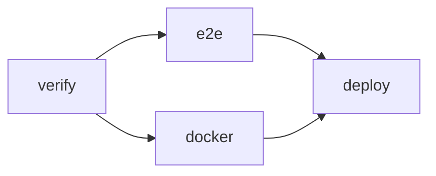

# How to configure the CI/CD pipeline

## Table of Contents

- [1. Purpose](#1-purpose)
- [2. Pipeline Overview](#2-pipeline-overview)
- [3. Jobs](#3-jobs)
- [4. Image Tags](#4-image-tags)
- [5. Enable Deployment](#5-enable-deployment)
  - [5.1 Prepare the server](#51-prepare-the-server)
  - [5.2 Create the SSH key](#52-create-the-ssh-key)
  - [5.3 Configure GitHub](#53-configure-github)
  - [5.4 Verify](#54-verify)
- [6. Release a Version](#6-release-a-version)
- [7. Related Documents](#7-related-documents)

## 1. Purpose

Explains the GitHub Actions workflow [.github/workflows/ci-cd.yml](../../.github/workflows/ci-cd.yml) and how to enable automatic deployment.

## 2. Pipeline Overview



Triggers: pushes to `main`, tags `v*`, pull requests and manual runs. A newer run on the same ref cancels the older one.

## 3. Jobs

| Job      | Steps                                                                                                                       | Runs on                                  |
| -------- | --------------------------------------------------------------------------------------------------------------------------- | ---------------------------------------- |
| `verify` | `npm ci`, lint, typecheck, unit tests with coverage; uploads `coverage/`                                                    | every trigger                            |
| `e2e`    | Installs Chromium, builds, runs Playwright; uploads the report on failure                                                   | every trigger                            |
| `docker` | Builds the runtime image, starts `docker compose`, runs the HTTPS smoke test (TST-009, TST-012); on push, publishes to GHCR | every trigger; publishing on push only   |
| `deploy` | Copies `compose.yaml` and `Caddyfile` over SSH, pulls the image, restarts the stack                                         | push to `main` when `DEPLOY_HOST` is set |

## 4. Image Tags

Published to `ghcr.io/<owner>/<repo>`:

| Trigger        | Tags                             |
| -------------- | -------------------------------- |
| Push to `main` | `main`, `sha-<full commit SHA>`  |
| Tag `v1.2.3`   | `1.2.3`, `sha-<full commit SHA>` |

The deploy job uses `sha-<full commit SHA>` so that each deployment is reproducible and can be rolled back ([PROC-002, Section 6](howto-deploy-to-server.md#6-rollback)).

## 5. Enable Deployment

### 5.1 Prepare the server

Complete [PROC-002](howto-deploy-to-server.md) Sections 2 and 3.1 once. The deploy user shall be able to run `docker` without `sudo`.

### 5.2 Create the SSH key

```bash
ssh-keygen -t ed25519 -N '' -C rasadgah-deploy -f rasadgah-deploy
ssh-copy-id -i rasadgah-deploy.pub user@server
```

### 5.3 Configure GitHub

In the repository, open **Settings → Secrets and variables → Actions**:

| Tab       | Name             | Value                                             |
| --------- | ---------------- | ------------------------------------------------- |
| Variables | `DEPLOY_HOST`    | Server hostname or IP                             |
| Variables | `SITE_ADDRESS`   | Public domain, for example `kpi.example.com`      |
| Secrets   | `DEPLOY_USER`    | SSH user                                          |
| Secrets   | `DEPLOY_SSH_KEY` | Content of the private key file `rasadgah-deploy` |

Then delete the local private key file. Optionally add protection rules to the `production` environment under **Settings → Environments**.

If the GHCR package is private, log in on the server once: `docker login ghcr.io`.

### 5.4 Verify

Push to `main`. The `deploy` job shows the environment URL; open it and check [PROC-002, Section 4](howto-deploy-to-server.md#4-verification).

## 6. Release a Version

```bash
git tag v0.1.0
git push origin v0.1.0
```

Update [REF-003 Release Notes](../08-release/release-notes.md) before tagging.

## 7. Related Documents

- [REF-001, Section 5](../07-reference/configuration.md#5-cicd-settings)
- [TST-000 Test Specification](../05-testing/test-specification.md)
